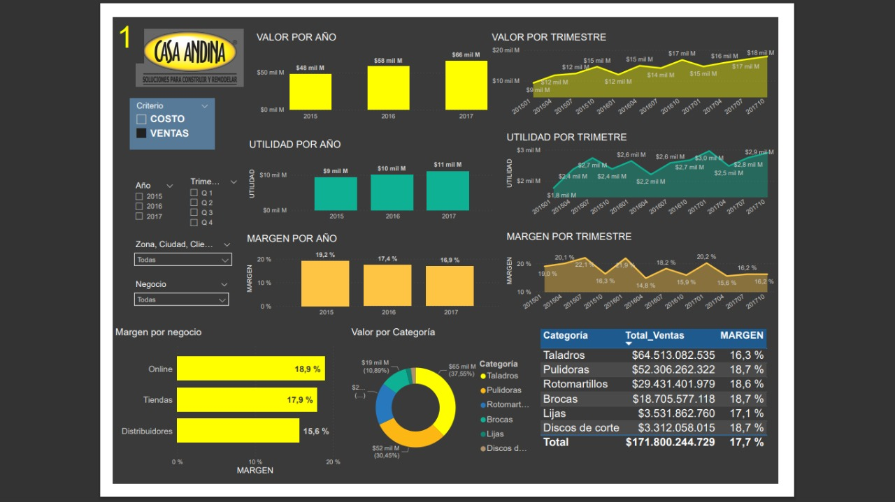
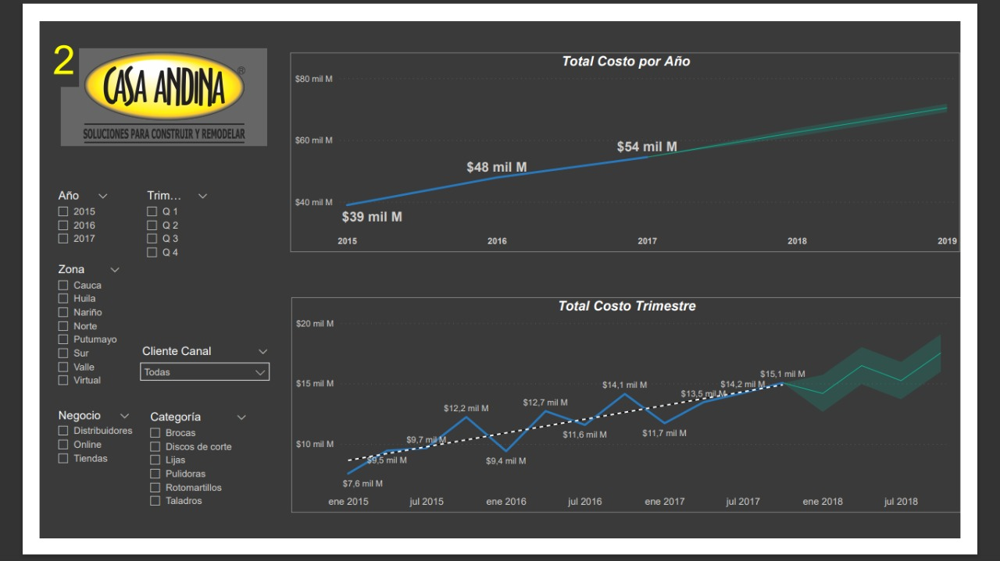

# Algo sobre mí.

Soy profesional en Administración de Empresas de la Universidad de Nariño, tengo conocimientos en campos como sistemas de gestión de calidad y analítica de datos para la toma de decisiones. He desempeñado labores administrativas y de desarrollo de proyectos, soy una persona caracterizada por un excelente manejo de relaciones interpersonales y  facilidad de aprendizaje en diferentes entornos, constantemente con gran motivación y sobre todo amor por el oficio.

# Portafolio

Aquí podras encontrar una muestra de mi trabajo en temas de ciencia de datos, análisis y visualización de información

## Muestra PowerBi Trascender Global

Hice un live con una startup que trabajé! 
Ahi mostramos en la comunidad sobre el uso de PowerBi para hacer Dashboards. Puedes ver la grabación de ese live dando click en este [enlace en línea](https://www.youtube.com/watch?v=Oy1beA81fwM)

## Dashboard Presupuesto
 
En este ejercicio hice la proyección de ventas y costos para el año 2018, con datos historicos de los años 2015, 2016 y 2017 de una empresa llamada Casa Andina. A estos datos se le aplicó ETL en Power Query para pasarlos a Power Bi con tablas auxiliares, como tablas de calendario y de medidas. Se calculó y presentó los ingresos, gastos, utilidad y margen de la compañia para los años registrados, asi como la estimación futura de estas variables con las opciones de analitics de Power Bi.
Se segmenta la información por zonas, ciudad, tiendas, tipo de negocio y categoria. 

## Reporte sobre estado de capacitaciones

En un proyecto freelancer para un cliente chileno, tuve que realizar el informe dinamico y visual para medir el porcentaje de cumplimiento de capacitaciones por departamentos y areas. A continuación puedes ver una muestra de ese reporte

# Contacto

- Correo: dicana27@gmail.com
